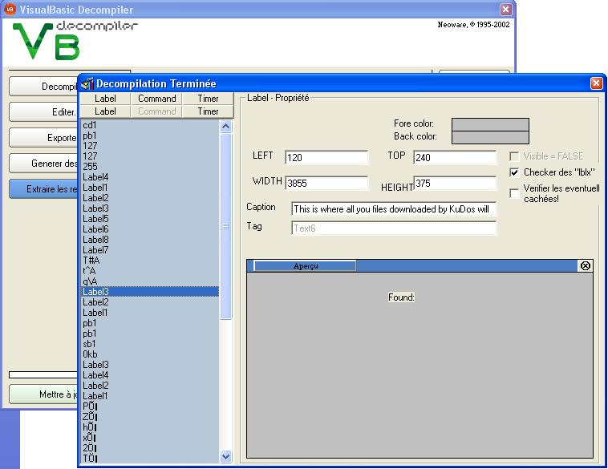



## A VBDecompiler 1\.1

### Description

This is a Visual Basic Decompiler

This program may decompile label, form and dependecies files

Please vote for me !
 
### More Info
 

             |
---                |---
**Submitted On**   |2002-04-27 16:20:44
**By**             |[Linky](https://github.com/Planet-Source-Code/PSCIndex/blob/master/ByAuthor/linky.md)
**Level**          |Advanced
**User Rating**    |4.2 (122 globes from 29 users)
**Compatibility**  |VB 3\.0, VB 4\.0 \(16\-bit\), VB 4\.0 \(32\-bit\), VB 5\.0, VB 6\.0
**Category**       |[Complete Applications](https://github.com/Planet-Source-Code/PSCIndex/blob/master/ByCategory/complete-applications__1-27.md)
**World**          |[Visual Basic](https://github.com/Planet-Source-Code/PSCIndex/blob/master/ByWorld/visual-basic.md)
**Archive File**   |[A\_VBDecomp764234272002\.zip](https://github.com/Planet-Source-Code/linky-a-vbdecompiler-1-1__1-34159/archive/master.zip)

